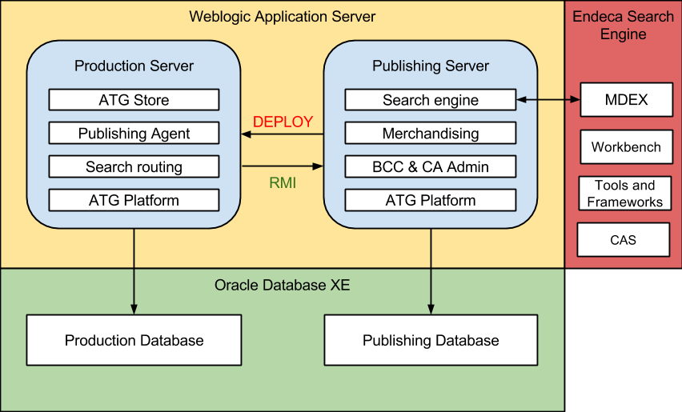

# ATG Starter Kit

* [Getting Started](#getting-started)
	* [What is ATG Starter Kit?](#what-is-atg-starter-kit)
	* [Technologies](#technologies)
	* [Architecture](#starter-kit-architecture)
	* [Requirements](#requirements)
	* [Who Wrote this Kit and Why?](#who-wrote-this-kit)
	* [How Does this Kit Work?](#how-does-it-work)
* [Setup](#setup)
	* [Step-by-step Setup Guide](#step-by-step-setup)
* [Advanced Topics](#advanced-topics)
	* [Add a Custom Module to CRS](docs/custom-crs.md)
	* [Replace Amazon EC2 cloud with Rackspace](docs/replace-ec2.md)
* [Known Issues](#issues)

## Getting Started

### What is ATG Starter Kit?

ATG Starter Kit is a cloud environment that enables developers to build and test eCommerce applications on Amazon AWS with [Qubell Adaptive PaaS](http://qubell.com). It presents the following key benefits:

- Offers a platform quick start by providing the tools needed to develop ATG eCommerce applications.
- Enables ATG application deployment from a GIT repository.
- Simplifies the process of deploying and configuring ATG Platform and Endeca Search Engine.
- Provides a thorough and complete example of ATG Commerce Reference Store with Endeca Search Engine running on Weblogic and Oracle Database. 

### Technologies

### Architecture

### Requirements
ATG Starter Kit requires an **m1.xlarge** AWS instance *or larger,* tested on one of the following images:

| Region  		| Image-AMI 			  		|
|------------|----------------------------|
|us-east-1		| us-east-1/ami-52009e3b		|
|eu-west-1		| eu-west-1/ami-8aa3a8fe		|
|us-west-1		| us-west-1/ami-0a2f024f		|
|us-west-2		| us-west-2/ami-e030a5d0		|
|ap-southeast-1	| ap-southeast-1/ami-0c034f5e	|
|ap-southeast-2	| ap-southeast-2/ami-f261f0c8	|
|ap-northeast-1	| ap-northeast-1/ami-651a9b64	|
|sa-east-1		| sa-east-1/ami-b32cf7ae		|
                
To use another image, you must specify its ID in your launch parameters, and mount a 20GB partition on `'--/media/ephimeral0'` (or edit manifest for installed components). We also recommend that you have a strong, working knowledge of Java. Other than that, you will be provided with all the code needed to deploy and modify the starter kit's sample web store, as well as with links to external documentation. Note that the Oracle third-party software used in the kit is available on the [Oracle website](http://www.oracle.com). 

### Who Wrote this Starter Kit and Why?

ATG Starter Kit was developed by [Grid Dynamics](http://www.griddynamics.com), in partnership with Qubell, to make creating solutions on the ATG platform with Endeca Search Engine faster and easier for ATG developers and QA engineers.

### How Does this Kit Work?

ATG Starter Kit has three main components:

* **ATG Platform** - A set of tools and libraries for developing, deploying and configuring eCommerce applications.
* **ATG Commerce Reference Store** - The sample web store, written using ATG Platform.
* **Endeca Search Engine** - A search engine that indexes and executes search queries from ATG CRS.

## Setup
You will need to set up the following in order to use ATG Starter Kit:

* A [Qubell Adaptive PaaS](http://qubell.com) account
* An Amazon AWS account
* Installation binaries, which are described in the [Getting Artifacts Guide](docs/get-artifacts.md)
	* ATG Platform 10.2
	* ATG Commerce Reference Store 10.2
	* JRockit 6r28
	* Weblogic 10.3.6
	* Oracle Database XE 11g
	* Tools and Frameworks 3.1.2
	* Platform Services 6.1.4
	* CAS 3.1.2.1
	* MDEX 6.4.1.2
* Access to git repository with CRS sources *(optional)*

Please refer to the steps below for getting set up.

### Step-by-step Setup Guide
- **[Step 1. Set up and Configure an Amazon Web Services (AWS) Account](docs/step-1-amazon-setup-guide.md)**
- **[Step 2. Set up a Qubell Account](docs/step-2-qubell-setup-guide.md)**
- **[Step 3. Obtain the ATG Starter Kit](docs/step-3-get-starter-kit.md)**
- **[Step 4. Launch the Application](docs/step-4-launch-guide.md)**

## Advanced Topics
- **[Add a Custom Module to CRS](docs/custom-crs.md)**
- **[Replace Amazon EC2 cloud with Backspace](docs/replace-ec2.md)**

## Known Issues
- **Long delay on request to the ATG Reference Store (CRS)**

	This is normal behavior. Weblogic must fully initialize the CRS servlet, so it can take a few minutes.
- **Search box doesn't appear on CRS home page**
	
	First, ensure that the Endeca service is working on Endeca Workbench. Then, try to refresh the page.
