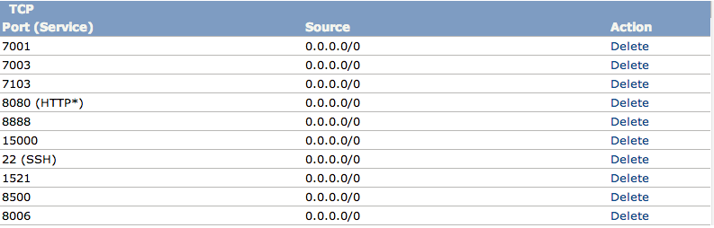

#### [Back to Readme](../readme.md)

#Step 1. Setup your Amazon Web Services (AWS) Account

Since you will be deploying the sample web store and analytics on Amazon Cloud, you must have an AWS account. The instructions below will walk you through configuring your AWS account's security group to allow traffic to your applications. 

First, **sign up for an Amazon EC2 account (one that supports EC2 nodes and S3).** If you don't have an AWS account, you can create one by navigating [here](http://aws.amazon.com/account/).

Once you've created your AWS account, you need to **configure your security group.** To configure your security group for ATG Starter Kit, follow the steps below.

1. Open your Amazon EC2 console at [https://console.aws.amazon.com/ec2/](https://console.aws.amazon.com/ec2/).
2. In the navigation pane, click **Security Groups**.
3. Select the security group named "**default**." 
4. Click on "**Inbound**" tab to add new rules (note that there should already be three existing/default rules). 

5. To add the new rules, select "**Custom TCP Rule**" from the "**Create a new rule**" drop-down list. In the "**Port Range**" field, enter the first port shown below (22) and click the "**+ Add Rule**" button. You will see that Port 22 now appears as open on the right side of your screen. Continue this process for each port shown below.

- For Qubell
    + 22
- For Weblogic
    + 7001
- For Oracle Database XE
    + 8080
    + 1521
- For ATG Platform and CRS
    + 7003
    + 7103
- For Endeca
    + 8006
    + 15000
    + 8888
    + 8500

Once you have added all rules, select the "**Apply Rule Changes**" button. The security group should appear similar to the image below after you have completed this task.

If you need additional help, please refer to the [Amazon portal](http://docs.aws.amazon.com/AWSEC2/latest/UserGuide/using-network-security.html#adding-security-group-rule). 

#### Next step: [Set up a Qubell Account](step-2-qubell-setup-guide.md)
