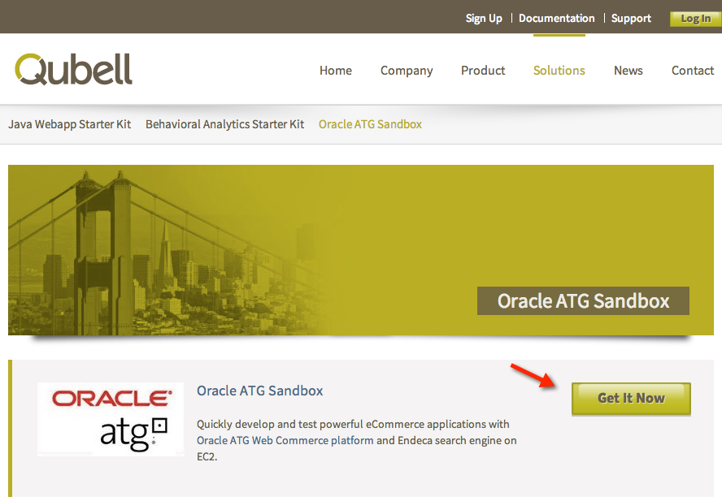
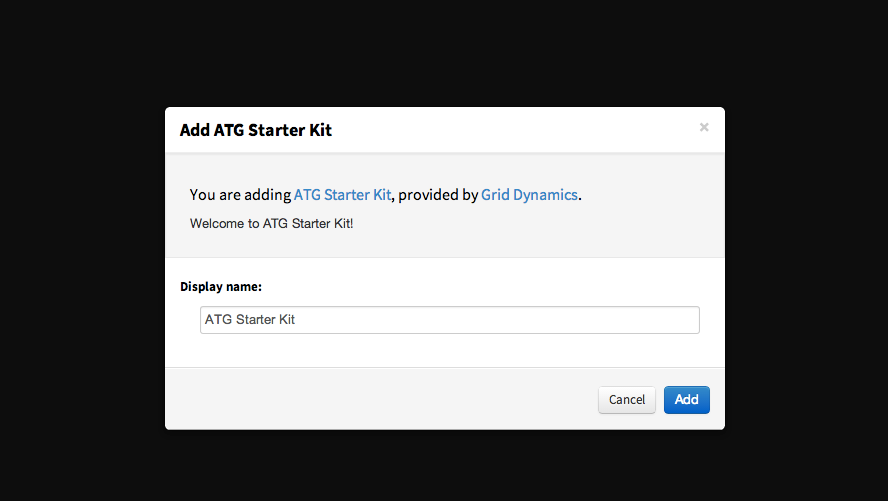

#### Previous Step: [Set up a Qubell Account](step-2-qubell-setup-guide.md)

Step 3. Get the ATG Starter Kit
===========================

To obtain the ATG Starter Kit,navigate to [http://qubell.com/solutions/oracle-atg-sandbox/](http://qubell.com/solutions/oracle-atg-sandbox/) and select the **Get It Now** button.

You will be prompted to confirm the installation within Qubell. Click the **Add** button to continue.

To confirm the installation, navigate to **Applications > Modules**.

#### Next step: [Launch the Application](step-4-launch-guide.md)
