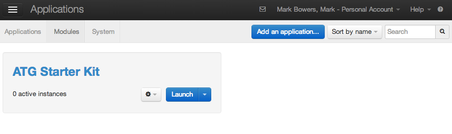
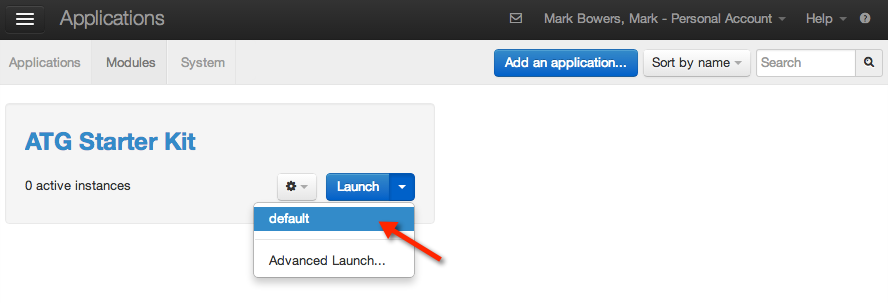
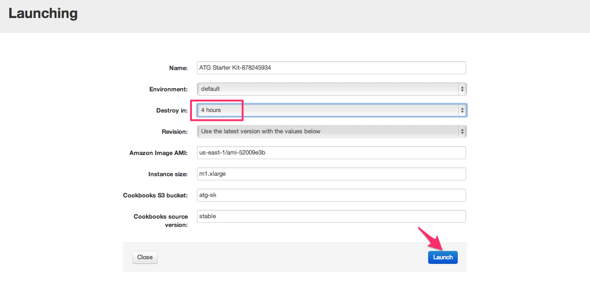
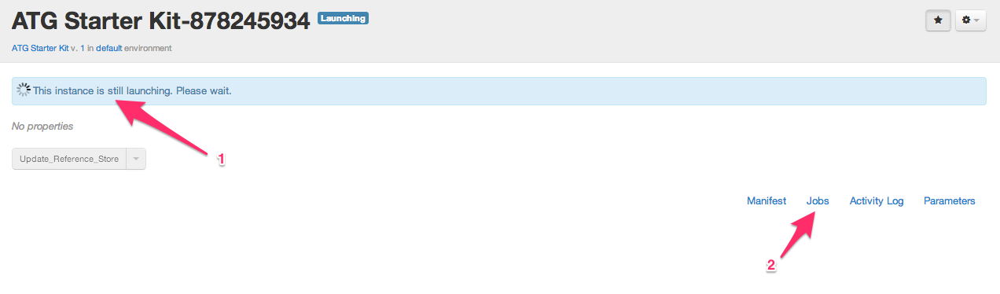
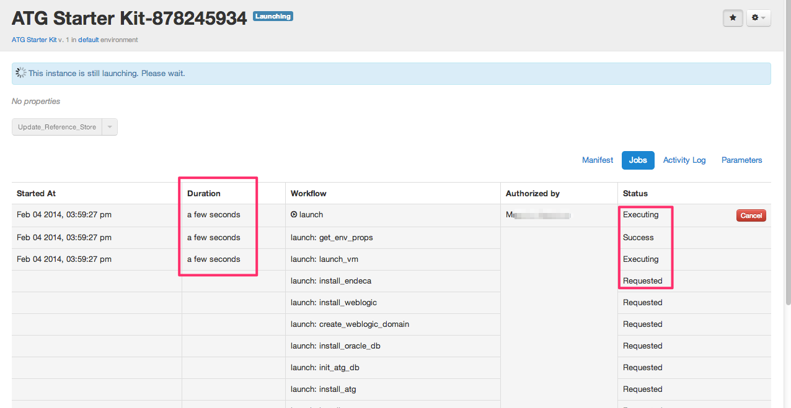
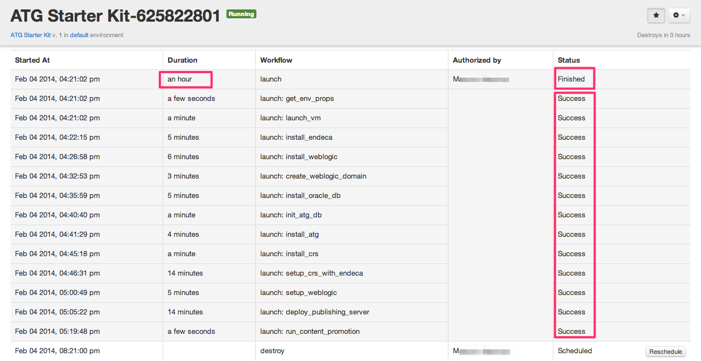
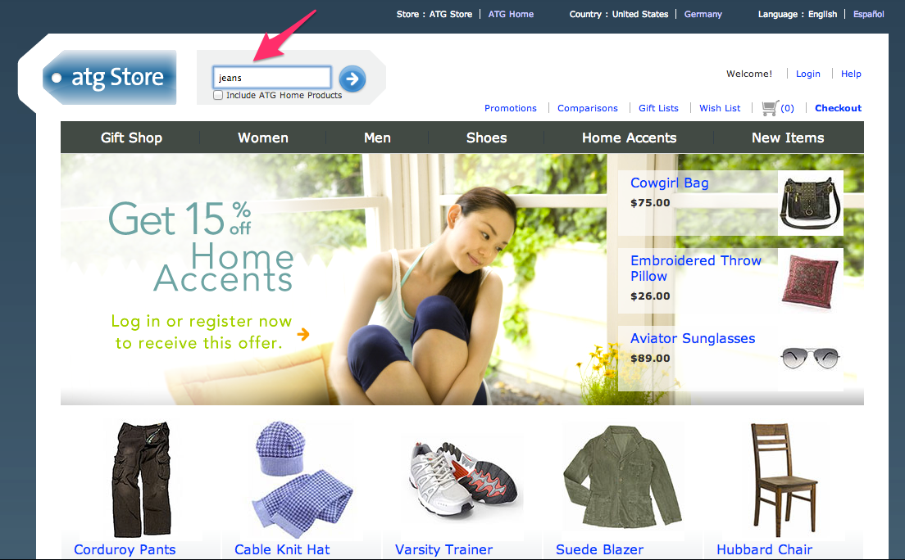

#### Previous Step: [Get the ATG Starter Kit](step-3-get-starter-kit.md)

#Step 4. Launch the Application

## Launching ATG Starter Kit

To launch ATG Starter Kit, navigate to **Applications > Modules**.

Select the **Launch** drop-down button and choose **default** to launch the instance or **Advanced Launch...** to change the default instance parameters (e.g. image AMI, instance size, cookbooks location on S3, and destroy time, which should be at least 2 hours).

Select the **Launch** button. The instance will take about an hour to reach a running state.

The status bar displays the current status (1). To obtain more information, click the **Jobs** menu (2).

**Jobs** displays current running workflows, along with their start times, current duration, name, user and status.

When the launch workflow (and sub-workflows) "*Finish*," the instance has reached its "Running State" and is ready to use.

Select the "**Open ATG Production Store**" button to open the demo store. You will see CRS with the Endeca search box. Feel free to test it by searching for an item like "jeans."

Your search results will appear shortly. For custom search results, use left selection panel.

## Commerce Reference Store Redeployment

**IMPORTANT: Set the git_repo env property first**

To redeploy CRS from customs sources, go to your Git repository, select **Update Reference Store > Advanced**. Use *master* as the default branch (or specify another branch or revision) and select "**Execute**." The redeployment process takes about 15 minutes.

#### [Back to Readme](../readme.md)
