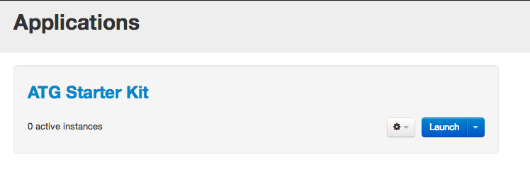
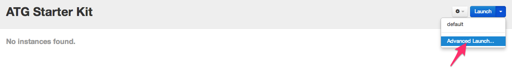

Step 4. Launch Application
=============================

### Launching 

Go to "Application" tab navigation bar. List of applications contains application "ATG Starter Kit"

To launch Starter Kit application press triangle button next to "Launch" - it's an options menu. Here you can select environment for application (avaliable only "default") or choose advanced lauch setup.

Press "Advanced Launch" button.

Now was opened lauch setup dialog. Here you can change default parameters for launching instance such as image ami, instance size, cookbooks location on S3. Select destory time for Starter kit. 

**!!! Destroy time should be at least 2 hours**

Press "Launch" button and wait until inctance gets a "Running state."
Full deployment process takes about an hour, so be patiant.

On status bar (1) displayes current status of inctance. To get more info click on "Jobs" menu (2).

In menu "Jobs" displaying current running workflows with their start timestamp, current duration, name, user and status.

When launch workflow become "Finished" with all successeful sub-workflows, instance will get to the "Running State". It means that application ready to use now.

Press "Open ATG Production Store" button to open demo store. CRS with Endeca search box will be opened. Test it by trying to search any kind of items, for example, jeans.

Results will appear shortly. For customization search results use left selection panel.

### Commerce Reference Store Redeployment

**!!! Set git_repo env propetry before using**

To redeploy CRS from customs sources from git repository press "Update_Reference_Store" triangle button and select "Advanced". Use master as default branch or specify another branch or revision and press "Execute", redeployment process takes about 15 minutes.
